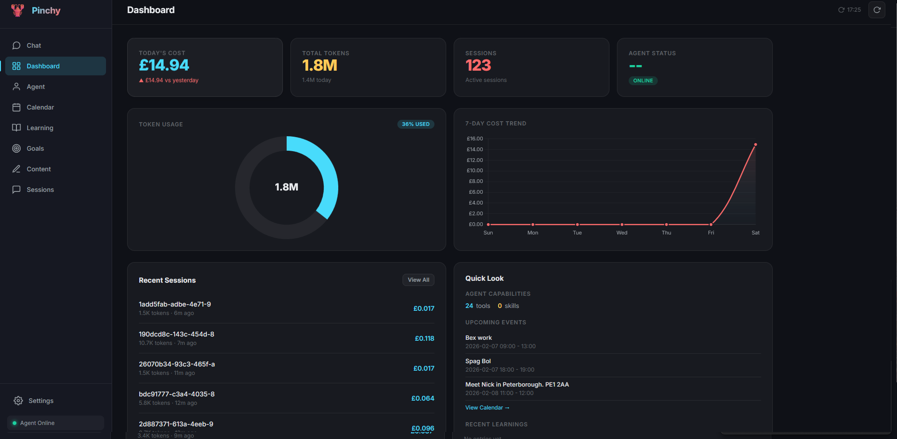

# Pinchy Dashboard

A modern dashboard for monitoring your [OpenClaw](https://github.com/openclaw-ai/openclaw) AI agent: token tracking, cost charts, session history, **chat with your agent**, goal management, content planning, learning log, calendar sync, and real-time agent health.




---

## Running with Docker

### Quick start

Pull the image and run:

```bash
docker pull finalbillybong/pinchy-dash:latest

docker run -d \
  --name pinchy-dash \
  -p 39876:39876 \
  -v ~/.openclaw:/root/.openclaw:rw \
  -v pinchy-data:/app/data \
  --restart unless-stopped \
  finalbillybong/pinchy-dash:latest
```

Open **http://localhost:39876** in your browser.

- **`~/.openclaw`** — Your OpenClaw data directory (sessions, memory, IDENTITY.md, etc.). Use the path that matches your setup; read-write is required if you want to edit Agent files from the dashboard.
- **`pinchy-data`** — A Docker volume where the dashboard stores config, chat history, goals, and other state. Omit the `-v pinchy-data:/app/data` line to use ephemeral storage (not recommended).

### Docker Compose

From the repo:

```bash
git clone https://github.com/finalbillybong/pinchy-dash.git
cd pinchy-dash
docker compose up -d
```

Then open **http://localhost:39876**.

Optional: create a `.env` file or set environment variables:

| Variable | Description |
|----------|-------------|
| `OPENCLAW_GATEWAY_URL` | Gateway URL (e.g. `http://192.168.1.100:18789`) |
| `OPENCLAW_GATEWAY_TOKEN` | Gateway auth token |
| `OPENCLAW_DATA_DIR` | Host path to OpenClaw data (default: `~/.openclaw`) |
| `CALENDAR_DATA_DIR` | Host path to vdirsyncer calendar data (optional) |

### First run

On first launch, the **onboarding wizard** will guide you through:

1. **Connect** — Enter your OpenClaw Gateway URL and token  
2. **Calendar** — Discover and enable calendars (optional)  
3. **Done** — You’re ready to use the dashboard  

You can change these later in **Settings**.

---

## Running on Unraid

### 1. Add the template

Copy the Unraid template into your user templates folder:

- On the Unraid server, copy **`pinchy-dash.xml`** to:
  - **`/boot/config/plugins/dockerMan/templates-user/`**

You can do this by:

- Placing `pinchy-dash.xml` in that path via SMB/USB, or  
- Using the **User Scripts** plugin / terminal, e.g.:
  ```bash
  mkdir -p /boot/config/plugins/dockerMan/templates-user
  wget -O /boot/config/plugins/dockerMan/templates-user/pinchy-dash.xml \
    https://raw.githubusercontent.com/finalbillybong/pinchy-dash/main/pinchy-dash.xml
  ```

### 2. Create the container

1. Open the **Docker** tab in the Unraid UI.  
2. Click **Add Container**.  
3. From the **Template** dropdown, select **Pinchy Dashboard** (or **pinchy-dash**).  
4. Set the following (others have defaults):

| Setting | What to set |
|--------|------------------|
| **Web UI Port** | Host port for the dashboard (default **39877**). Use this in the WebUI URL. |
| **Dashboard Data** | Path for persistent dashboard data, e.g. **`/mnt/user/appdata/pinchy-dash/data`**. |
| **OpenClaw Data Path** | Path to your OpenClaw data on the host, e.g. **`/mnt/user/appdata/openclaw/config/`**. |
| **Calendar Data Path** | (Optional) Path to vdirsyncer calendar data, or leave empty. |
| **OpenClaw Gateway URL** | (Optional) Your Gateway URL; can be set in the web UI instead. |
| **OpenClaw Gateway Token** | (Optional) Gateway token; can be set in the web UI instead. |

5. Click **Apply** to pull the image and start the container.

### 3. Open the dashboard

In the container list, use **WebUI** for Pinchy Dashboard, or go to:

**http://*your-unraid-ip*:39877**

(Use the host port you set in **Web UI Port** if different from 39877.)

### 4. Updates

To update to the latest image:

- **Force Update**: Edit the container → **Force Update** (or **Advanced View** → **Force Update**), then **Apply**.  
- Or remove the container (keep the paths/data), add it again from the same template, and **Apply** to pull the latest image.

---

## Features

- **Dashboard** — Token usage, cost over time, session count  
- **Chat** — Talk to your OpenClaw agent via the Gateway  
- **Agent** — View and edit IDENTITY.md and SOUL.md  
- **Calendar** — Upcoming events (ICS or via agent)  
- **Learning** — Agent memory and daily notes  
- **Goals** — Track and manage goals  
- **Content** — Content planning and tracking  
- **Sessions** — Browse session history  

For more detail (configuration, chat, calendar, security, local/non-Docker runs), see **[SETUP.md](SETUP.md)**.

---

## License

MIT
